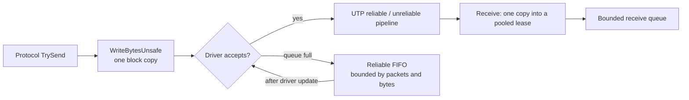

# Static ECS Network Unity Transport

Unity Transport adapter for the complete-packet `INetworkTransport` contract. It is an
alternative to the LiteNetLib transport.

## Send and receive



- `TrySend` consumes the lease on every result; `true` means accepted locally, not delivered.
- Reliable packets that the driver rejects wait in a FIFO and are retried in order after the
  next driver update.
- Reliable receive overflow disconnects only that connection; unreliable overflow drops the packet.
- The reliable preflight (`CanAcceptReliablePacket`) and pending state reflect only the adapter
  FIFO. Raw UTP has no per-packet delivery callback, so bytes already handed to UTP are not tracked.

## Settings

| `UnityTransportSettings` | Default | Meaning |
|---|---|---|
| `ReliableWindowSize` | 64 (max 2040; above 64 must be a multiple of 8) | Reliable in-flight window; the fragmentation header size is derived from it |
| `ServerSendQueueCapacity` | `max(512, 2 × connections × window)` | Native send and receive queue size for a listener |
| `ReliableSendBytesCapacity` | 256 KiB | Per-connection byte limit of the reliable FIFO |
| `ReceiveQueueCapacity` | 256 | Per-connection receive queue in packets |
| `MaximumConnections` | 128 | Accepted server connections |

- Default port: `7777`.
- Largest unreliable complete packet: 1400 bytes; largest reliable complete packet: 64 KiB.

## Diagnostics

Channel traffic, failures, queue depth and high-water mark, overflows, disconnects, leases,
plus UTP driver statistics (Rx/Tx bytes and packets, queue usage) and per-connection reliable
statistics (resent, dropped, duplicated, out of order, latency).

## Usage

```csharp
var settings = UnityTransportSettings.Default;
using var client = new UnityTransportClientHost(settings);
client.Update(); // before protocol receive
client.Flush();  // after protocol send
```

Server endpoints from `UnityTransportServerHost.TryAccept` go to the transport-neutral
server; drain disconnect notifications after each update. Client disposal sends and flushes
a native disconnect.
